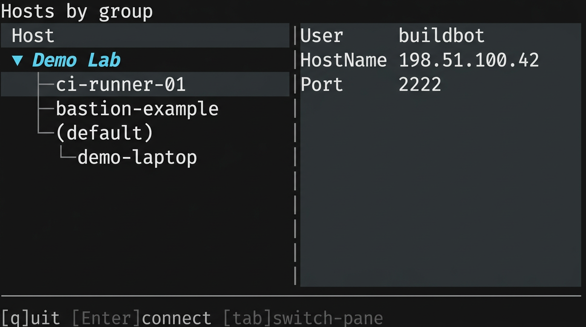
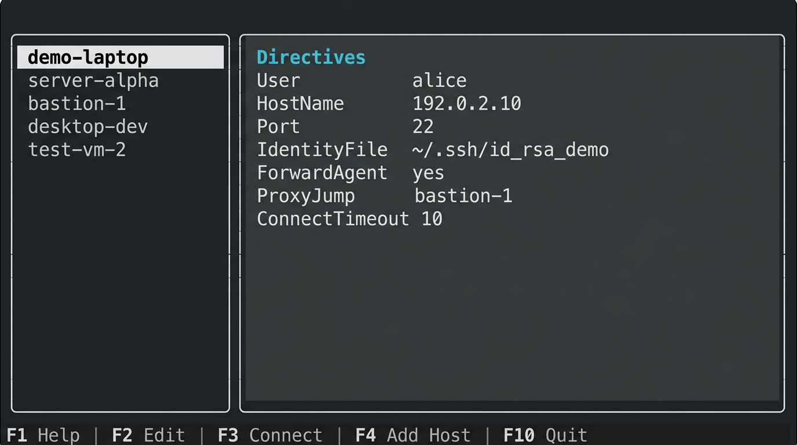
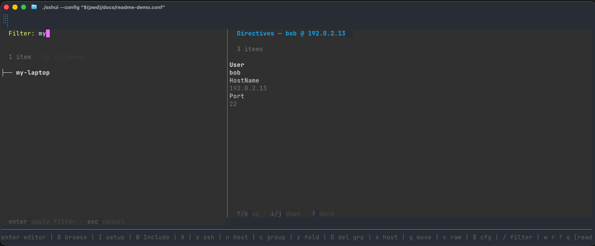

# sshui

Keyboard-driven terminal UI for managing OpenSSH client configuration. Built with [Bubble Tea](https://github.com/charmbracelet/bubbletea).



## Install

**Go (1.25+):**

```bash
go install github.com/sacckth/sshui/cmd/sshui@latest
```

**Linux packages** (`.deb`, `.rpm`, `.apk`) and **macOS/Linux tarballs** are available on the [Releases](https://github.com/sacckth/sshui/releases) page.

**Build from source:**

```bash
git clone https://github.com/sacckth/sshui.git
cd sshui
make build    # or: go build -o sshui ./cmd/sshui/
```

## Quick start

```bash
sshui                              # opens ~/.config/sshui/ssh_hosts (default)
sshui --config ~/.ssh/config       # open a specific file
```

Press `?` inside the TUI for the full keybinding reference.

### Key bindings at a glance

| Key | Action |
|-----|--------|
| `enter` | Open host detail or password host detail |
| `/` | Filter hosts |
| `s` | SSH to selected host |
| `B` | Cycle browse mode (merged / openssh / password) |
| `n` / `c` | New host / new group |
| `w` / `r` | Save / reload |
| `v` | Raw editor (`$EDITOR`) |
| `z` | Fold/unfold group |
| `$` | Edit app settings in `$EDITOR` |
| `?` | Help |
| `q` | Quit |

### CLI

```bash
sshui list                         # tab-separated host list
sshui show myhost --json           # single host detail
sshui dump --check                 # verify canonical format
sshui completion zsh               # shell completions
```

## Configuration

sshui uses three files, all optional and auto-created on first run:

| File | Purpose |
|------|---------|
| `~/.config/sshui/config.toml` | App settings (theme, editor, paths, browse mode) |
| `~/.config/sshui/ssh_hosts` | OpenSSH-format host definitions (primary edit target) |
| `~/.config/sshui/password_hosts.toml` | Password overlay for SSH_ASKPASS-based auth |

On first run, sshui creates a default `config.toml` and offers to import existing hosts from `~/.ssh/config`. An `Include` directive is automatically appended to your main ssh config so that `ssh <alias>` works from the shell without sshui.

### Dual tree: main ssh_config + managed hosts

When `ssh_config` in `config.toml` points to a different file than `ssh_hosts_path` (the default setup), the TUI shows both:

- **🔒 unmanaged** -- read-only hosts from your main `~/.ssh/config`, shown in a dimmer color. Groups defined with `#@group:` metadata are preserved (shown with a 🔒 suffix).
- **✏️  managed** -- editable hosts in `ssh_hosts` (the primary edit target).

Hosts in the ssh_config section cannot be edited directly. To move a host into the managed file, select it, press `A` (Actions), then choose **Import**. sshui copies the host and prompts to remove it from the main file (default: yes).

See [docs/CONFIGURATION.md](docs/CONFIGURATION.md) for the full settings reference and path resolution.

### Password hosts

Password-authenticated hosts are defined in `password_hosts.toml` and use `SSH_ASKPASS` for secret delivery -- no plaintext passwords in any config file. See [docs/ASKPASS.md](docs/ASKPASS.md) for integration recipes with `pass`, `gopass`, KeePassXC, `secret-tool`, and `age`.

## Screenshots

The images in this README are illustrative. To capture real screenshots with a safe demo config:

```bash
sshui --config docs/readme-demo.conf
```

See [docs/SCREENSHOTS.md](docs/SCREENSHOTS.md) for details.





## Contributing

```bash
make test         # run the test suite
make build        # compile
go fmt ./...      # format
go vet ./...      # lint
```

Architecture notes and coding conventions are in [AGENTS.md](AGENTS.md). The project uses standard Go tooling with no CGO dependencies.

**Release process:** set `version` in `cmd/sshui/main.go`, commit, then `make tag-push`. CI builds packages and publishes to [Releases](https://github.com/sacckth/sshui/releases). See [docs/RELEASING.md](docs/RELEASING.md) for the full workflow.

## License

[BSD 3-Clause](LICENSE)
